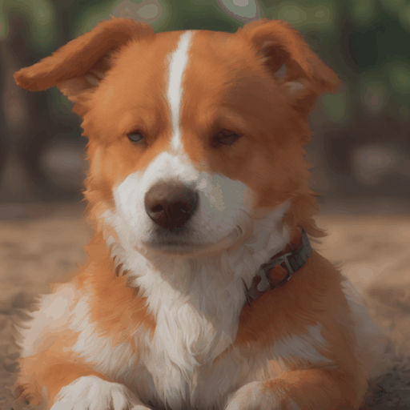

<center></center>
<p></p>
<p align="center">
<a href="https://pypi.org/project/torch-nos/"></a>
<a href="https://pypi.org/project/torch-nos/"></a>
<a href="https://www.pepy.tech/projects/torch-nos"></a>
<a href="https://github.com/autonomi-ai/nos/blob/main/LICENSE"></a><br>
<a href="https://discord.gg/QAGgvTuvgg"></a>
<a href="https://twitter.com/autonomi_ai"></a>
</p>
<p align="center">
<a href="https://docs.nos.run/"><b>Website</b></a> | <a href="https://docs.nos.run/"><b>Docs</b></a> |  <a href="https://discord.gg/QAGgvTuvgg"><b>Discord</b></a>
</p>

## What is NOS?
**NOS (`torch-nos`)** is a fast and flexible Pytorch inference server, specifically designed for optimizing and running inference of popular foundational AI models.
<br>

## **Why use NOS?**

- 👩‍💻 **Easy-to-use**: Built for [PyTorch](https://pytorch.org/) and designed to optimize, serve and auto-scale Pytorch models in production without compromising on developer experience.
- 🥷 **Flexible**: Run and serve several foundational AI models ([Stable Diffusion](https://huggingface.co/stabilityai/stable-diffusion-xl-base-1.0), [CLIP](https://huggingface.co/openai/clip-vit-base-patch32), [Whisper](https://huggingface.co/openai/whisper-large-v2)) in a single place.
- 🔌 **Pluggable:** Plug your front-end to NOS with out-of-the-box high-performance gRPC/REST APIs, avoiding all kinds of ML model deployment hassles.
- 🚀 **Scalable**: Optimize and scale models easily for maximum HW performance without a PhD in ML, distributed systems or infrastructure.
- 📦 **Extensible**: Easily hack and add custom models, optimizations, and HW-support in a Python-first environment.
- ⚙️ **HW-accelerated:** Take full advantage of your underlying HW (GPUs, ASICs) without compromise.
- ☁️ **Cloud-agnostic:** Run on any cloud HW (AWS, GCP, Azure, Lambda Labs, On-Prem) with our ready-to-use inference server containers.


> **NOS** inherits its name from **N**itrous **O**xide **S**ystem, the performance-enhancing system typically used in racing cars. NOS is designed to be modular and easy to extend.
<br>

## **What can NOS do?**

### 💬 Chat / LLM Agents (ChatGPT-as-a-Service)
---
NOS provides an OpenAI-compatible server with streaming support so that you can connect your favorite LLM client.


<table>
<tr>
<td> gRPC API ⚡ </td>
<td> REST API </td>
</tr>
<tr>
<td>

```python
from nos.client import Client

client = Client("[::]:50051")

model = client.Module("meta-llama/Llama-2-7b-chat-hf")
response = model.chat(message="Tell me a story of 1000 words with emojis")
```

</td>
<td>

```bash
curl \
-X POST http://localhost:8000/v1/chat/completions \
-H "Content-Type: application/json" \
-d '{
    "model": "meta-llama/Llama-2-7b-chat-hf",
    "messages": [{"role": "user", "content": "Tell me a story of 1000 words with emojis"}],
    "temperature": 0.7, "stream": true
  }'
```

</td>
</tr>
</table>


### 🏞️ Image Generation (Stable-Diffusion-as-a-Service)
---
Build MidJourney discord bots in seconds.


<table>
<tr>
<td> gRPC API ⚡ </td>
<td> REST API </td>
</tr>
<tr>
<td>

```python
from nos.client import Client

client = Client("[::]:50051")

sdxl = client.Module("stabilityai/stable-diffusion-xl-base-1-0")
image, = sdxl(prompts=["fox jumped over the moon"],
              width=1024, height=1024, num_images=1)
```

</td>
<td>


```bash
curl \
-X POST http://localhost:8000/v1/infer \
-H 'Content-Type: application/json' \
-d '{
    "model_id": "stabilityai/stable-diffusion-xl-base-1-0",
    "inputs": {
        "prompts": ["fox jumped over the moon"],
        "width": 1024,
        "height": 1024,
        "num_images": 1
    }
}'
```

</td>
</tr>
</table>


### 🧠 Text & Image Embedding (CLIP-as-a-Service)
---
Build scalable semantic search of images/videos in minutes.


<table>
<tr>
<td> gRPC API ⚡ </td>
<td> REST API </td>
</tr>
<tr>
<td>

```python
from nos.client import Client

client = Client("[::]:50051")

clip = client.Module("openai/clip-vit-base-patch32")
txt_vec = clip.encode_text(texts=["fox jumped over the moon"])
```

</td>
<td>

```bash
curl \
-X POST http://localhost:8000/v1/infer \
-H 'Content-Type: application/json' \
-d '{
    "model_id": "openai/clip-vit-base-patch32",
    "method": "encode_text",
    "inputs": {
        "texts": ["fox jumped over the moon"]
    }
}'
```

</td>
</tr>
</table>


### 🎙️ Audio Transcription (Whisper-as-a-Service)
---

Perform real-time audio transcription using Whisper.


<table>
<tr>
<td> Preview </td>
<td> gRPC API ⚡ </td>
<td> REST API </td>
</tr>
<tr>
<td>

```python
from pathlib import Path
from nos.client import Client

client = Client("[::]:50051")

model = client.Module("openai/whisper-large-v2")
with client.UploadFile(Path("audio.wav")) as remote_path:
  response = model(path=remote_path)
# {"chunks": ...}
```

</td>
<td>

```bash
curl \
-X POST http://localhost:8000/v1/infer/file \
-H 'accept: application/json' \
-H 'Content-Type: multipart/form-data' \
-F 'model_id=openai/whisper-large-v2' \
-F 'file=@audio.wav'
```

</td>
</tr>
</table>

### 🧐 Object Detection (YOLOX-as-a-Service)
---

Run classical computer-vision tasks in 2 lines of code.


<table>
<tr>
<td> gRPC API ⚡ </td>
<td> REST API </td>
</tr>
<tr>
<td>

```python
from pathlib import Path
from nos.client import Client

client = Client("[::]:50051")

model = client.Module("yolox/medium")
response = model(images=[Image.open("image.jpg")])
```

</td>
<td>

```bash
curl \
-X POST http://localhost:8000/v1/infer/file \
-H 'accept: application/json' \
-H 'Content-Type: multipart/form-data' \
-F 'model_id=yolox/medium' \
-F 'file=@image.jpg'
```

</td>
</tr>
</table>


### ⚒️ Custom models
---
Want to run models not supported by NOS? You can easily add your own models following the examples in the [NOS Playground](https://github.com/autonomi-ai/nos-playground/tree/main/examples).

### Text to video
```python
model_id: str = "animate-diff"
```


### Image to video
```python
model_id: str = "stable-video-diffusion"
```


### Text to 360-view images
```python
model_id: str = "mv-dream"
```


## 📚 Documentation

- [Quickstart](https://docs.nos.run/docs/quickstart.html)
- [Models](https://docs.nos.run/docs/models/supported-models.html)
- **Concepts**: [Architecture Overview](https://docs.nos.run/docs/concepts/architecture-overview.html), [ModelSpec](https://docs.nos.run/docs/concepts/model-spec.html), [ModelManager](https://docs.nos.run/docs/concepts/model-manager.html), [Runtime Environments](https://docs.nos.run/docs/concepts/runtime-environments.html)
- **Demos**: [Building a Discord Image Generation Bot](https://docs.nos.run/docs/demos/discord-bot.html), [Video Search Demo](https://docs.nos.run/docs/demos/video-search.html)

## 📄 License

This project is licensed under the [Apache-2.0 License](LICENSE).

## 🤝 Contributing
We welcome contributions! Please see our [contributing guide](CONTRIBUTING.md) for more information.

### 🔗  Quick Links

* 💬 Send us an email at [support@autonomi.ai](mailto:support@autonomi.ai) or join our [Discord](https://discord.gg/QAGgvTuvgg) for help.
* 📣 Follow us on [Twitter](https://twitter.com/autonomi\_ai), and [LinkedIn](https://www.linkedin.com/company/autonomi-ai) to keep up-to-date on our products.

<br>
<style> .md-typeset h1, .md-content__button { display: none; } </style>
