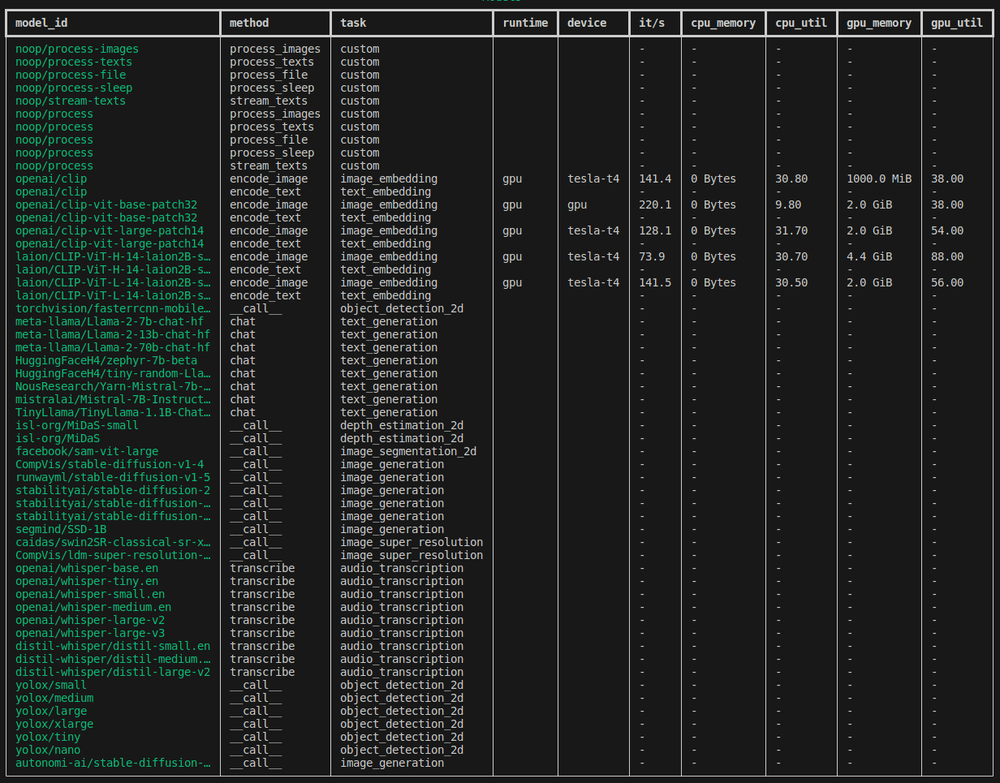
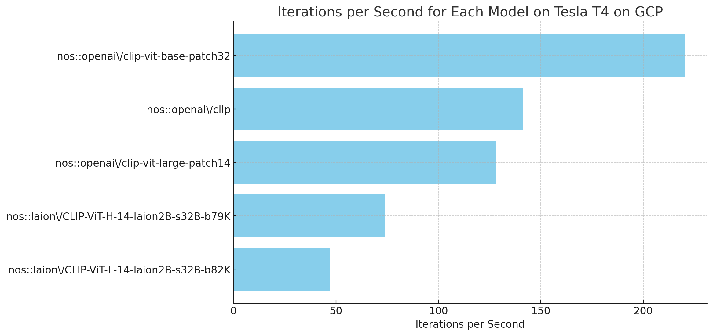
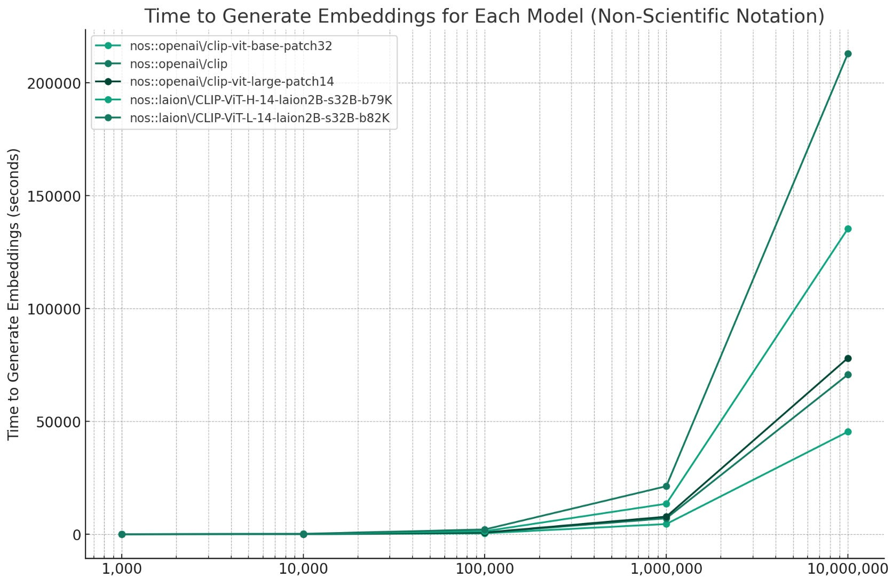
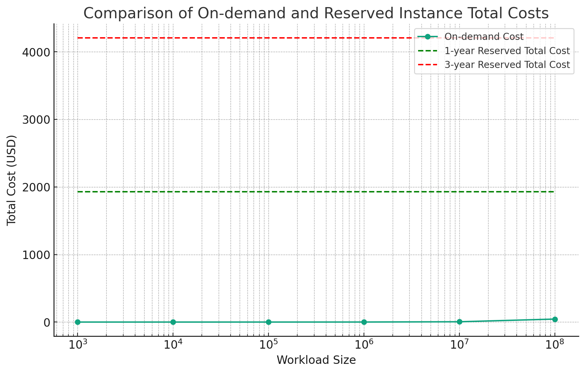
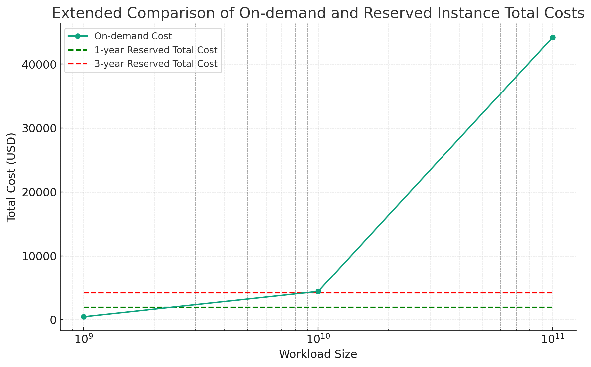

# OK Computer, Why are you slow?

(Originally published at https://scottloftin.substack.com/p/lets-build-an-ml-sre-bot-with-nos)

In this post, we'll be going over a set of experiments we've run with the NOS profiler and Skypilot to automatically answer questions about your infra using retrieval 
on top of pricing and performance data.

Figuring out the best platform for a given model begins with benchmarking, and unfortunately today this is still somewhat painful on Nvidia hardware let alone other platforms. Most folks rely on leaderboards published by Anyscale, Huggingface, Martian (my personal favorite!), and many others, but setting aside debates over methodology and fairness, we are still mostly looking at quoted numbers for a top-level inference API without a lot of knobs to turn on the underlying HW. NOS provides a profiling tool that can benchmark Text/Image embedding, Image Generation and Language across GPUs and across clouds. Let’s start with some local numbers on a 2080:

```bash
nos profile method --method encode_image
nos profile list
```



We see a breakdown across four different image embedding models including the method and task (interchangeable in this case, each CLIP variant will support both Image and Text embedding as methods), the Iterations per Second, GPU memory footprint (how much space did this model have to allocate) and finally the GPU utilization, which measures (in a very broad sense) how efficiently we are using the HW. A few things to note: the image size is fixed to 224X224X1 across all runs with a batch size of 1. In practice, the Iterations/Second will depend tremendously on tuning the batch size and image resolution for our target HW, which will be the subject of a followup post. For now we’ll take these (admittedly naive) numbers at face value and see what we can work out about how exactly to run a large embedding workload. We’re going to use a fantastic tool called Skypilot to deploy the profiler to a Tesla T4 instance on GCP:

```bash
sky launch -c nos-profiling-service skyserve.dev.yaml --gpus=t4
```

This will run the above model variants on our chosen instance and write everything to a bucket in GCS, which I’ve already downloaded:

```
[
    {
        "namespace":"nos::openai\/clip-vit-base-patch32",
        "profiling_data":{
            "init::memory_gpu::pre":1001259008,
            "init::memory_cpu::pre":18951331840,
            "init::memory_gpu::post":1640890368,
            "init::memory_cpu::post":19440001024,
            "forward::memory_gpu::pre":1640890368,
            "forward::memory_cpu::pre":19440001024,
            "forward::memory_gpu::post":1642987520,
            "forward::memory_cpu::post":19440001024,
            "forward_warmup::execution":{
                "num_iterations":436,
                "total_ms":2003.6902427673,
                "cpu_utilization":9.8,
                "gpu_utilization":38
            },
            "forward::execution":{
                "num_iterations":1101,
                "total_ms":5002.1767616272,
                "cpu_utilization":9.8,
                "gpu_utilization":38
            },
            "cleanup::memory_gpu::pre":1642987520,
            "cleanup::memory_cpu::pre":19443097600,
            "cleanup::memory_gpu::post":1003356160,
            "cleanup::memory_cpu::post":19445149696,...
```

This snippet shows a breakdown of memory allocation and runtime across various stages of execution (we’re mostly interested in forward::execution). Even this short list of profiling info is quite a lot to pick apart: we would ordinarily be doing a lot of envelope math and maybe scrub through each iteration in the chrome profiling tool, but lets see if we can streamline things a bit with more modern tools.

## 🤖 Our InfraBot Chat Assistant

The OpenAI assistants API is somewhat unstable at the moment, but after a few tries it was able to ingest the profiling catalog as raw JSON and answer a few questions about its contents. Let’s start simple:

_Hey InfraBot, can you list the models in the profiling catalog by iterations per second?_



Ok, our raw profiling data is slowly becoming more readable. Let’s see how this all scales with number of embeddings:

_Can you compute how long it would take to generate embeddings with each model for workload sizes in powers of 10, starting at 1000 image embeddings and ending at 10,000,000. Please plot these for each model in a graph._



Reasonable: runtime will depend linearly on total embeddings (again, we’re using batch size 1 for illustration purposes).

The more interesting question is: what hardware should we use given price constraints? While ChatGPT can probably provide a solid high level answer describing the tradeoffs between on-demand, spot and reserved instances, as well as the value of performance of the underlying card relative to time spent on other tasks like copying data, we’ll need to provide hard numbers on instance prices if we want something concrete.

## 💵 Adding Pricing Information with Skypilot

Skypilot proves a utility for fetching pricing and availability for a variety of instance types across the big 3 CSPs (AWS, Azure and GCP). I was able to generate a summary below (lightly edited to work with Substack formatting):

```
GPU  QTY  CLOUD  INSTANCE_TYPE          HOURLY_PRICE  HOURLY_SPOT_PRICE  
T4   1    AWS    g4dn.xlarge            $ 0.526       $ 0.063            
T4   1    AWS    g4dn.2xlarge           $ 0.752       $ 0.091            
T4   1    AWS    g4dn.4xlarge           $ 1.204       $ 0.141            
T4   1    AWS    g4dn.8xlarge           $ 2.176       $ 0.255            
T4   1    AWS    g4dn.16xlarge          $ 4.352       $ 0.483            
T4   4    AWS    g4dn.12xlarge          $ 3.912       $ 0.528            
T4   8    AWS    g4dn.metal             $ 7.824       $ 0.915            
T4   1    Azure  Standard_NC4as_T4_v3   $ 0.526       $ 0.053            
T4   1    Azure  Standard_NC8as_T4_v3   $ 0.752       $ 0.075            
T4   1    Azure  Standard_NC16as_T4_v3  $ 1.204       $ 0.120            
T4   4    Azure  Standard_NC64as_T4_v3  $ 4.352       $ 0.435            
T4   1    GCP    (attachable)           $ 0.350       $ 0.070            
T4   2    GCP    (attachable)           $ 0.700       $ 0.140            
T4   4    GCP    (attachable)           $ 1.400       $ 0.279    
```

Ok, lets add some dollar signs to our plot above:

_Can you compute how much it would cost on a T4 with 1 GPU to generate embeddings with the cheapest model for workloads of powers of 10, starting at 1000 image embeddings and ending at 10,000,000. Please plot these in a graph._


The above looks reasonable assuming a minimum reservation of 1 hour (we aren’t doing serverless, we need to pay for the whole instance for the whole hour in our proposed cloud landscape). For 10 million embeddings, the total is something like 13 hours, so assuming an on-demand price of $0.35 we have 0.35*13 ~= 0.455, pretty close to the graph. But what if we wanted to index something like YouTube with ~500PB of videos? Ok, maybe not the whole site, but a substantial subset, maybe 10^11 images: if we extrapolate the above we’re looking at $40,000 in compute, which we would probably care about fitting to our workload. In particular, we might go with a reserved rather than an on-demand instance for a ~%50 discount, but at what point does that pay off? Unfortunately at time of writing, Skypilot doesn’t seem to include reserved instance pricing by default, but for a single instance type it’s easy enough to track down and feed to InfraBot: a 1 Year commitment brings us down to $0.220 per GPU, and a 3 Year commitment to $0.160 per GPU. It’s still higher than the spot price of course, but at this scale its reasonable to assume some SLA that prevents us from halting indexing on preemption. Let’s see if we can find a break-even point.

_Can you add the cost to reserve a 1 and 3 year instance? A 1 year reservation is $0.220 per gou per hour, and a 3 year reservation is $0.160 per gpu per hour._



Looks like we need to go a little further to the right

_Ok can you do the same plot, but at 10^9, 10^10, and 10^11_



10^10 embeddings at $0.35/hr is about $4,860, so this looks roughly correct. 10 Billion embeddings is about 100,000 Hours of (low resolution) video at full 30FPS, so while it’s quite large its not completely unheard of for a larger video service.


## The Verdict?

This is a very simple example of a line of questioning that might confront someone managing an ML service, with a fairly simple answer that was straightforward to generate with an already non-bleeding-edge LLM. With the right catalog data and a lot of patience, it stands to reason that we could answer far more sophisticated questions about inference costs and even automatically act on these decision points by generating Infra-as-Code on the fly. In any case, it’s a useful way to pick apart what are normally very opaque inference stats, and something I’ve been pulling out of my own toolkit more and more. Just make sure to check the math every now and again!

