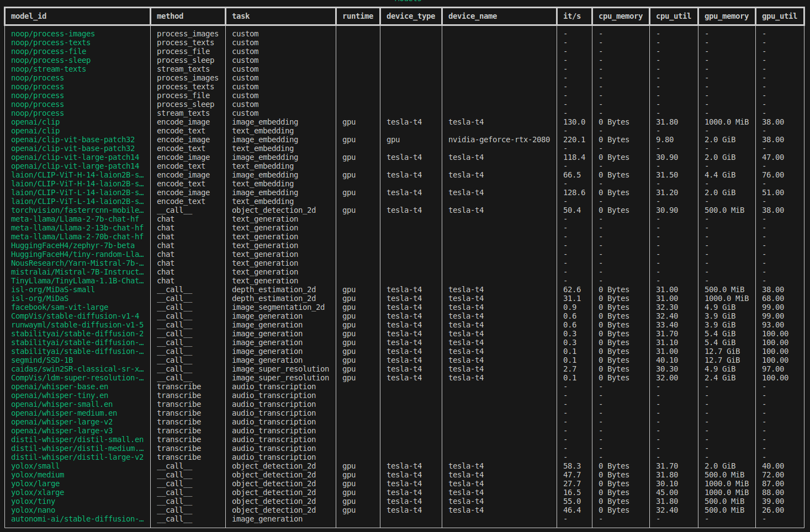

## ⏱️ Profiling Models

`nos profile` supports model benchmarking across a number of axes including iterations per second,
memory footprint and utilization on CPU/GPU.
Currently, the nos profiler itself runs natively in the execution environment (i.e. outside
the NOS server), so you'll need to install both the `server` and `test` dependencies alongside
your existing NOS installation.

```bash
pip install torch-nos[server,test]
```

## NOS Profile Commands

### all
Profile all models

If you have the time, you can construct a profiling catalog on your machine in its entirety with:
```bash
nos profile all
```
### rebuild-catalog
Generate a fresh catalog with 
```bash
nos profile rebuild-catalog
```
### model
You can also profile specific models with 
```bash
nos profile model -m openai/clip-vit-large-patch14
```
### method
Or an entire method type with
```bash
nos profile method -m encode_image
```
to benchmark e.g. all image embedding models.

### list
Dump the nos profiling catalog with `nos profile list`

