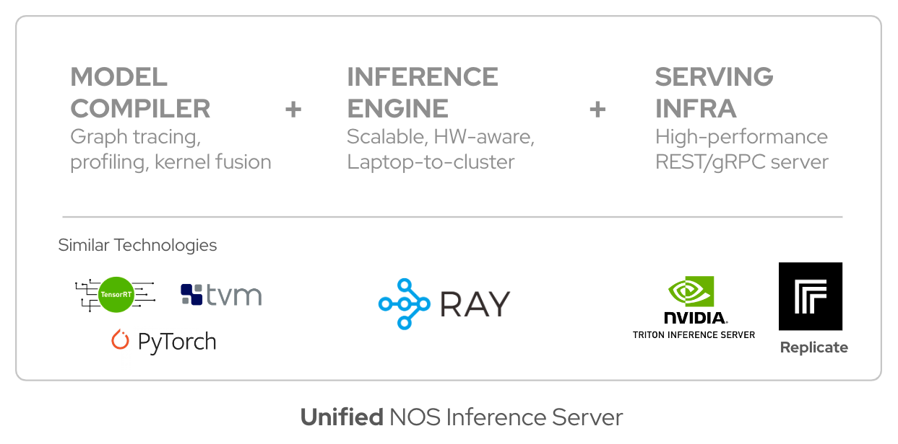
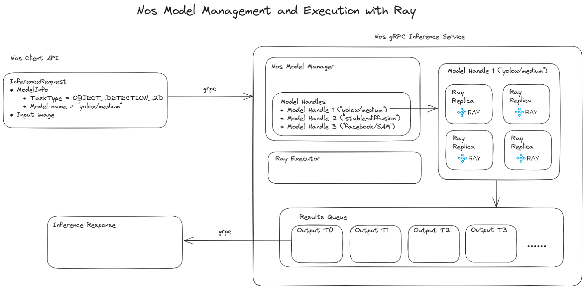

## Architecture Overview

## Core Features
 - **Batteries-included:** Server-side inference with all the necessary batteries (model hub, batching/parallelization, fast I/O, model-caching, model resource management via ModelManager, model optimization via ModelSpec)
 - **Server-side inference without client-side bloat:** Multiple lightweight clients can leverage complex server-side inference workers without the bloat of GPU libraries, runtimes or 3rd-party libraries.
 - **High device-utilization:** With better model management, client’s won’t have to wait on model inference and instead can take advantage of the full GPU resources available. Model multiplexing, and efficient bin-packing of models will allow us to leverage the resources optimally (without the user’s knowledge).
 - **Custom model support:** We use Ray to configure different worker configurations (custom conda environment, with resource naming) to run workers on different runtime environments. For example, if you want to run a model on a custom runtime environment, you can provide custom `pip` requirements (see [example](./custom-models.md)).

## Core Components

 NOS is built to be modular and extensible. The core components of NOS are:

- [**`ModelManager`**](./model-manager.md): Model manager for serving and running models with Ray actors.
- [**`InferenceService`**](#inferenceservice): Ray-executor based inference service that executes inference requests.
- [**`InferenceRuntimeService`**](#inferenceruntimeservice): Dockerized runtime environment for server-side remote execution

### InferenceService

The `InferenceService` along with the `InferenceServiceImpl` gRPC service implementation provides a fully wrapped inference service via gRPC/HTTP2. The `InferenceServiceImpl` wraps the relevant API services such as `ListModels()`, `GetModelInfo()` and crucially `Run()` and executes the inference request via the `InferenceService` class. The `InferenceService` class manages models via the `ModelManager`, and sets up the necessary execution backend via `RayExecutor`. In addition to this, it is also responsible for managing shared memory regions (if requested) for high-performance inference running locally in a single machine.

### Nomenclature

- **Device memory**: We refer to device and GPU memory interchangeably
- **Runtime**: A dockerized runtime environment that has just the pertinent runtime libraries and binaries for execution purposes. The build or compilation libraries are removed via multi-stage builds.
- **Executor**: A single-node ray head that orchestrates inference jobs. We use Ray actors for device-inference and orchestrating auto-scaling (eventually in the multi-node case).
