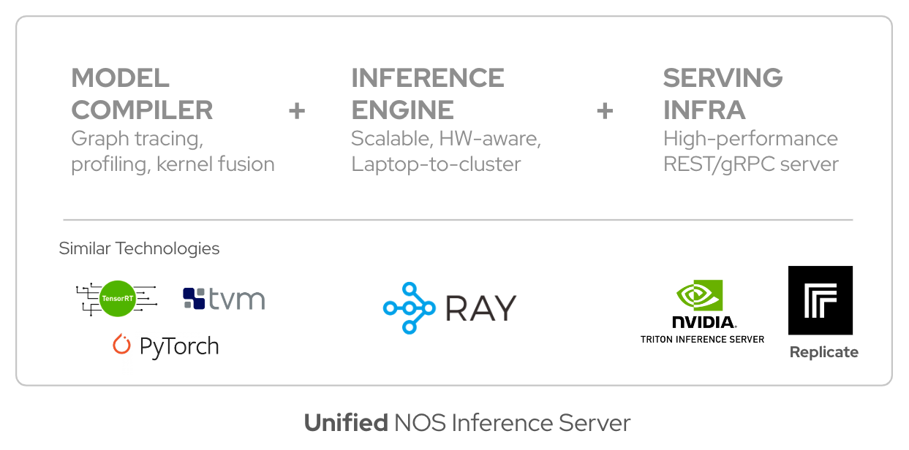
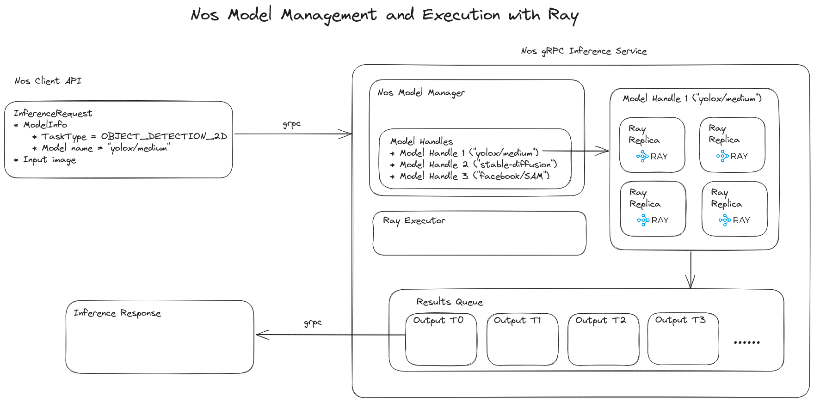

!!!note ""
    **NOS** is a PyTorch library for optimizing and running lightning-fast inference of popular computer vision models.

  Optimizing and serving models for production AI inference is still difficult, often leading to notoriously expensive cloud bills and often underutilized GPUs. That’s why we’re building **NOS** - a fast inference server for modern AI workloads. With a few lines of code, developers can optimize, serve, and auto-scale Pytorch model inference without having to deal with the complexities of ML compilers, HW-accelerators, or distributed inference. Simply put, NOS allows AI teams to cut inference costs up to **10x**, speeding up development time and time-to-market.

## Architecture Overview

## Core Features
 - **Batteries-included:** Server-side inference with all the necessary batteries (model hub, batching/parallelization, fast I/O, model-caching, model resource management via ModelManager, model optimization via ModelSpec)
 - **Server-side inference without client-side bloat:** Multiple lightweight clients can leverage complex server-side inference workers without the bloat of GPU libraries, runtimes or 3rd-party libraries.
 - **High device-utilization:** With better model management, client’s won’t have to wait on model inference and instead can take advantage of the full GPU resources available. Model multiplexing, and efficient bin-packing of models will allow us to leverage the resources optimally (without the user’s knowledge).
 - **Custom model support:** We use Ray to configure different worker configurations (custom conda environment, with resource naming) to run workers on different runtime environments. For example, if you want to run a model on a custom runtime environment, you can provide custom `pip` requirements (see [example](./custom-models.md)).

## Core Components

 NOS is built to be modular and extensible. The core components of NOS are:

- [**`ModelManager`**](#modelmanager): Model manager for serving and running models with Ray actors.
- [**`InferenceService`**](#inferenceservice): Ray-executor based inference service that executes inference requests.
- [**`InferenceRuntimeService`**](#inferenceruntimeservice): Dockerized runtime environment for server-side remote execution

Let's break this down:

### ModelManager
The model manager is the main workhorse of the NOS server. It is responsible for managing the lifecycle of models, executing inference requests across a pool of workers that may live on heterogenous hardware devices. The model manager is responsible for the following:

- **Remote Model Execution:** The model manager is responsible for the remote inference / execution of models concurrently ac across a pool of workers. We use [Ray](https://www.ray.io/) to distribute the inference workloads. In addition to this, the manager also maintains a the functional specification of the model allowing NOS to optionally trace and compile relevant code-paths that are critical for low-latency execution. This allows developers to further optimize and increase performance of their models without explicitly generating compilation or traced artifacts through these ahead-of-time tool chains. In essence, the model manager provides a logical handle for remote model execution while leveraging the appropriate hardware devices available for model inference (CPUs, GPUs, ASICs).

 - **Distributed Inference:** On top of remote model execution, NOS leverages [Ray](https://www.ray.io/) to scale models across large number of GPUs/HW-accelerators to fully utilize large compute clusters, and auto-scaling models based on load. This allows NOS to scale models across multiple nodes, and leverage the full compute capacity of the cluster.

- **Automatic Batched Execution:** By profiling the model, we can determine the optimal batch size for maximum throughput. We can then batch inference requests to maximize throughput. The model manager takes care of batching requests implicitly, allowing users to simply submit tasks asynchronously while the model manager effectively dispatches the inference tasks to an appropriately scaled pool of workers.

- **Device Memory Management:** One of the difficulties with using Pytorch is that you would have maunally manage all the device memory without much visibility into the memory profiles of each model. The onus is on the developer to manually profile each model they run, and appropriately allocate the model on the device memory. This becomes especially inconvenient when dealing with tens of models that may have different memory profiles. With the model manager, we make this transparent to the user so that they can fully utilize their underlying HW without having to manaully tune their model with every deployment.

- **Garbage Collection:** Large models can take up a lot of device memory, and it is important to free up memory when it is no longer needed. The model manager is responsible for garbage collecting models that are no longer needed. We implement a FIFO eviction policy for garbage collection, but this can be extended to other policies such as LRU, LFU etc. While FIFO (first-in first-out) is a simple and predictable policy, it is also the most effective in practice.

- **Model Compilation:** Coming Soon!

### InferenceService

The `InferenceService` along with the `InferenceServiceImpl` gRPC service implementation provides a fully wrapped inference service via gRPC/HTTP2. The `InferenceServiceImpl` wraps the relevant API services such as `ListModels()`, `GetModelInfo()` and crucially `Run()` and executes the inference request via the `InferenceService` class. The `InferenceService` class manages models via the `ModelManager`, and sets up the necessary execution backend via `RayExecutor`. In addition to this, it is also responsible for managing shared memory regions (if requested) for high-performance inference running locally in a single machine.

### InferenceRuntimeService
We use docker to configure different worker configurations to run workloads in different runtime environments. The configured runtime environments are specified in the [InferenceServiceRuntime](/docs/api/server#inferenceserviceruntime) class, which wraps the generic [`DockerRuntime`] class. For convenience, we have pre-built some runtime environments that can be used out-of-the-box `cpu`, `gpu`, `trt-runtime` etc.

This is the general flow of how the runtime environments are configured:
- Configure runtime environments including `cpu`, `gpu`, `trt-runtime` etc in the [`InferenceServiceRuntime`](/docs/api/server#inferenceserviceruntime) `config` dictionary.
- Start the server with the appropriate runtime environment via the `--runtime` flag.
- The ray cluster is now configured within the appropriate runtime environment and has access to the appropriate libraries and binaries.

For custom model support, we use Ray to configure different worker configurations (custom conda environment, with resource naming) to run workers on different runtime environments.

## Model Specification
- **Deterministic:** We benchmark the models during model registry, so you are guaranteed execution runtimes and device resource-usage. More specifically, the model specification will allow us to measure memory consumption and FLOPs ahead-of-time and enable more efficient device-memory usage in production.
- **Scalable:** Registered models can be independently scaled up for batch inference or parallel execution with Ray actors.
- **Optimizable:** Every registered model can be inspected, compiled and optimized with a unique and configurable runtime-engine (TRT, ONNX, AITemplate etc). This allows us to benchmark models before they enter production, and run models at the optimal (or configurable) operating point.

### Nomenclature

- **Device memory**: We refer to device and GPU memory interchangeably
- **Runtime**: A dockerized runtime environment that has just the pertinent runtime libraries and binaries for execution purposes. The build or compilation libraries are removed via multi-stage builds.
- **Executor**: A single-node ray head that orchestrates inference jobs. We use Ray actors for device-inference and orchestrating auto-scaling (eventually in the multi-node case).
