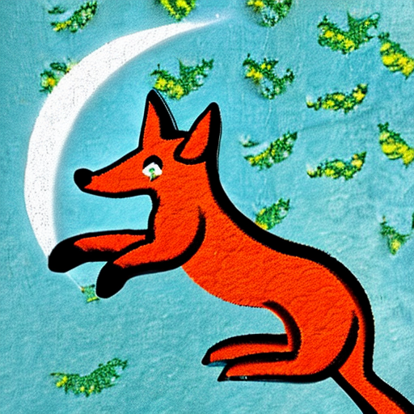

## Text and Image embedding with OpenAI CLIP

```python
import nos
from nos.client import Client, TaskType
from PIL import Image
import requests

nos.init(runtime="gpu")
client = Client()
client.WaitForServer()
client.IsHealthy()

url = "https://raw.githubusercontent.com/open-mmlab/mmdetection/main/demo/demo.jpg"
img = Image.open(requests.get(url, stream=True).raw).resize((640, 480))

# single image
predictions = client.Run("openai/clip", inputs={"images": [img]}, method="image_embedding")
print(predictions["embedding"].shape) # 1X512

# batched N=3
predictions = client.Run("openai/clip", inputs={"images": [img, img, img]}, method="image_embedding")
print(predictions["embedding"].shape) # 3X512
```

Text embeddings follow a similar pattern:

```python
text_string = "the quick brown fox jumped over the lazy dog"
predictions = client.Run("openai/clip", inputs={"texts": [text_string]}, method="text_embedding")
predictions["embedding"].shape

```

## Image Generation with Stable Diffusion

- Stability AI
    * Stable Diffusion 2
    * Stable Diffusion 2.1
- RunwayML
    * stable-diffusion-v1.4
    * stable-diffusion-v1.5

Let's generate a few images with Stable Diffusion V2:
```python
import nos
from nos.client import Client, TaskType
from PIL import Image
import requests

nos.init(runtime="gpu")
client = Client()
client.WaitForServer()
client.IsHealthy()

prompts = ["fox jumped over the moon", "fox jumped over the sun"]
predictions = client.Run("stabilityai/stable-diffusion-2",
                         inputs={"prompts": prompts, "width": 512, "height": 512, "num_images": 1})

for prompt, image in zip(prompts, predictions["images"]):
    print(prompt, image.size)
    display(image)
```




## Audio Transcription with Whisper

The current interface requires that a `.wav` be serialized into base64 and passed in as a string. The following snippet demonstrates a simple youtube->text transcription flow with `ytd`.

```python
from nos.client import Client
from nos.common import TaskType
from yt_dlp import YoutubeDL

nos.init(runtime="gpu")
client = Client()
client.WaitForServer()
client.IsHealthy()

# Short util to extract .wav files from youtube urls
def download_youtube_url_and_transcribe(url):
    ydl_opts = {
        "format": "bestaudio/best",
        "postprocessors": [
            {
                "key": "FFmpegExtractAudio",
                "preferredcodec": "wav",
                "preferredquality": "192",
            }
        ],
    }

    with YoutubeDL(ydl_opts) as ydl:
        # set download location to current directory
        info_dict = ydl.extract_info(url, download=False)
        output_filename = ydl.prepare_filename(info_dict)
        audio_filename = output_filename.replace(".webm", ".wav")
        error_code = ydl.download([url])
        assert error_code == 0

    with open(audio_filename, "rb") as f:
        audio_data = f.read()

    # serialize wav to base64
    import base64
    audio_data_base64 = base64.b64encode(audio_data).decode("utf-8")

    # run transcription
    predictions = client.Run("openai/whisper-tiny.en", inputs={"audio" : audio_data_base64})
    print(predictions["text"])

youtube_url = "https://www.youtube.com/watch?v=EFfJEB1jkSo"
download_youtube_url_and_transcribe(youtube_url)
```

## Object Detection with YoloX

NOS Supports a variety of YoloX variants for object detection including:

- nano
- tiny
- small
- medium
- large
- xlarge

```python
import nos
from nos.client import Client, TaskType
from PIL import Image
import requests
import cv2
import numpy as np

nos.init(runtime="gpu")
client = Client()
client.WaitForServer()
client.IsHealthy()

url = "https://raw.githubusercontent.com/open-mmlab/mmdetection/main/demo/demo.jpg"
img = Image.open(requests.get(url, stream=True).raw).resize((640, 480))

def visualize_det2d(img: np.ndarray, bboxes: np.ndarray, labels: np.ndarray) -> np.ndarray:
    """Visualize 2D detection results on an image."""
    vis = np.asarray(img).copy()
    for bbox, label in zip(bboxes.astype(np.int32), labels):
        cv2.rectangle(vis, (bbox[0], bbox[1]), (bbox[2], bbox[3]), (0, 255, 0), 2)
    return vis

# Run YOLOX prediction on the image and get the prediction results as a dictionary.
# predictions = {"bboxes", "scores", "labels"}.
predictions = client.Run("yolox/nano", inputs={"images": [img]})
for idx, (img, bboxes, scores, labels) in enumerate(zip([img], predictions["bboxes"], predictions["scores"], predictions["scores"])):
    display(Image.fromarray(visualize_det2d(img, bboxes, labels)))
```


