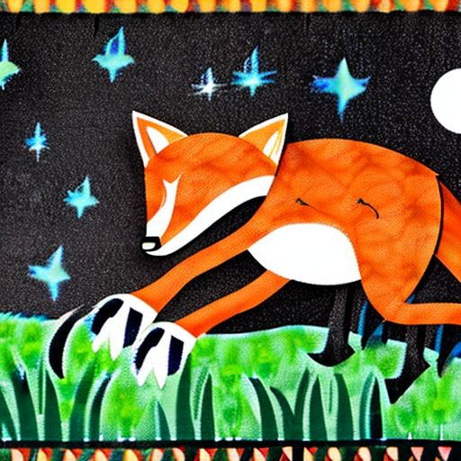
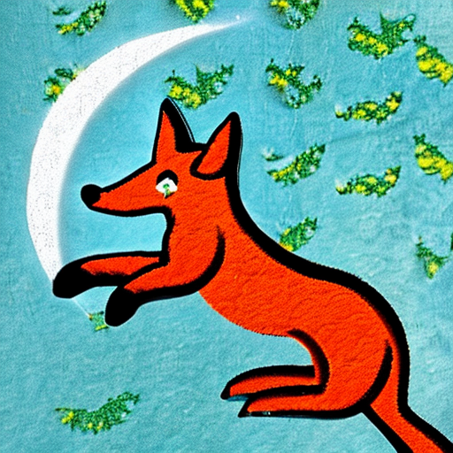

NOS comes with a variety of image generation models, including:

- Stability AI
    * Stable Diffusion 2
    * Stable Diffusion 2.1
- RunwayML
    * stable-diffusion-v1.4
    * stable-diffusion-v1.5

Let's generate a few images with Stable Diffusion V2:
```python
import nos
from nos.client import Client, TaskType
from PIL import Image
import requests

nos.init(runtime="gpu")
client = Client()
client.WaitForServer()
client.IsHealthy()

prompts = ["fox jumped over the moon", "fox jumped over the sun"]
predictions = client.Run(TaskType.IMAGE_GENERATION, "stabilityai/stable-diffusion-2",
                         inputs={"prompts": prompts, "width": 512, "height": 512, "num_images": 1})

for prompt, image in zip(prompts, predictions["images"]):
    print(prompt, image.size)
    display(image)
```




